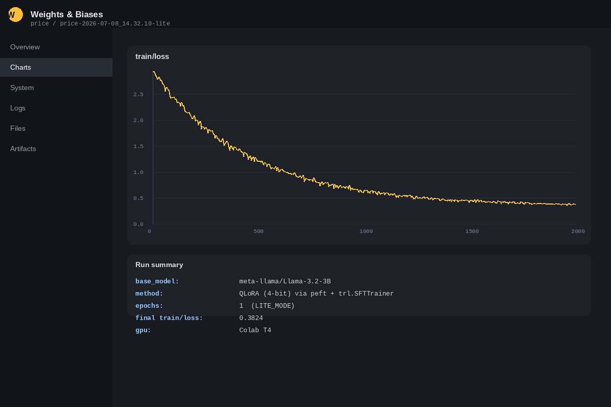
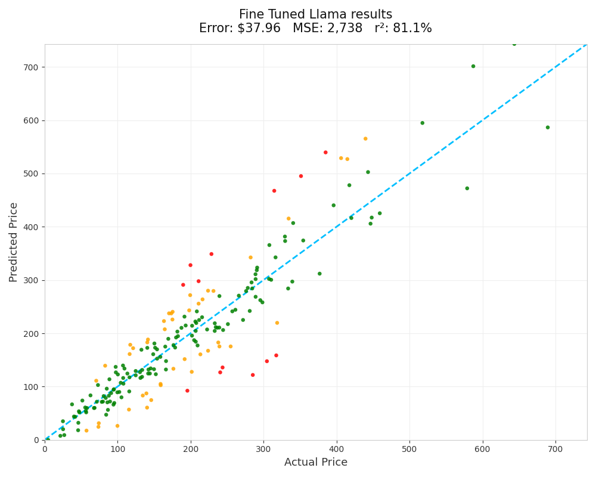

# The Price Is Right — Open Source Price Predictor 💰🤖

A project that fine-tunes an open-source LLM (**Llama 3.2 3B**) to predict a product's price purely from its text description, using QLoRA and 4-bit quantization — and benchmarks it against a frontier model baseline (GPT-4.1-nano) and human-level performance.

## Overview

The workflow runs in four stages:

1. **Prompt & data prep** — build prompt/completion pairs from a product dataset (title + description → price), push them to the Hugging Face Hub.
2. **Base model check** — evaluate the untrained base model's zero-shot price-guessing ability as a starting reference point.
3. **Fine-tuning** — quantize Llama 3.2 3B to 4-bit and fine-tune it with **QLoRA** (via `peft`'s `LoraConfig` and `trl`'s `SFTTrainer`), tracked with Weights & Biases. Designed to run on Google Colab (a free T4 GPU for `LITE_MODE`, or a paid GPU for the full dataset/run).
4. **Evaluation & analysis** — run the fine-tuned model on a held-out test set, score it with a custom `Tester` (average error, MSE, R², color-coded scatter plots), and compare against the human benchmark (~$87.62 avg error) and GPT-4.1-nano (~$62.51 avg error).


## Application Preview

### Weights & Biases Training Dashboard

<p align="center">
  
</p>

### Model Evaluation Results

<p align="center">
  
</p>


## Files

| File / Folder | Description |
|---|---|
| `prompt_data_and_base_model.ipynb` | Builds prompt/completion training data from the item dataset and evaluates the un-fine-tuned base model as a baseline. Uses the [`items_prompts_lite`](https://huggingface.co/datasets/ed-donner/items_prompts_lite) / [`items_prompts_full`](https://huggingface.co/datasets/ed-donner/items_prompts_full) datasets. |
| `open_source_model_training.ipynb` | The core fine-tuning notebook — loads `meta-llama/Llama-3.2-3B` in 4-bit, configures LoRA + `SFTConfig` hyperparameters, trains with `SFTTrainer`, and pushes the fine-tuned model to the Hugging Face Hub. Logs run metrics to Weights & Biases. |
| `fine_tuned_model_evaluation.ipynb` | Loads the fine-tuned model in inference mode and scores it against the test set, comparing results to the human and GPT-4.1-nano baselines. |
| `results_analysis.ipynb` | Analyzes and visualizes final results. |
| `pricer/items.py` | `Item` pydantic model representing a product datapoint (title, category, price, prompt/completion) with helpers to build prompts, count tokens, and push/pull datasets from the Hugging Face Hub. |
| `pricer/evaluator.py` | `Tester` class — runs a predictor function over a test set in parallel, computes average error / MSE / R², and renders Plotly scatter and error-trend charts. |
| `util.py` | Standalone (non-parallel) version of the `Tester` evaluation helper, used in earlier/simpler evaluation notebooks. |
| `requirements.txt` | Python dependencies for the project environment. |

## Key Concepts Covered

- **Parameter-efficient fine-tuning (PEFT)**: 4-bit quantization (`BitsAndBytesConfig`) + **QLoRA** (`LoraConfig`) to fine-tune a 3B-parameter model affordably on consumer/free-tier GPUs
- **Supervised fine-tuning with TRL**: using `SFTTrainer` / `SFTConfig` to fine-tune on prompt-completion pairs
- **Experiment tracking**: logging training runs to Weights & Biases
- **Dataset workflow**: preparing, pushing, and loading structured prompt datasets via the Hugging Face Hub
- **Rigorous evaluation**: comparing a fine-tuned open-source model against both a human benchmark and a frontier closed-source model (GPT-4.1-nano) using consistent error metrics (avg error, MSE, R²)
- **LITE_MODE workflow**: a smaller/faster config (`LITE_MODE=True`) for prototyping on a free T4 GPU before scaling up to a full run

## Setup

```bash
pip install -r requirements.txt
jupyter lab
```

- These notebooks are designed for a **GPU environment** (Google Colab is used in the original workflow — a free T4 works with `LITE_MODE=True`; a paid GPU is recommended for the full dataset/run).
- Create a Hugging Face account and token (for model/dataset access and pushing your fine-tuned model), and a Weights & Biases account/API key (for training run tracking). Add these as Colab secrets or environment variables before running the training/evaluation cells.
- Run the notebooks in order: `prompt_data_and_base_model.ipynb` → `open_source_model_training.ipynb` → `fine_tuned_model_evaluation.ipynb` → `results_analysis.ipynb`.

## Results

The fine-tuned Llama 3.2 3B model is benchmarked against:
- **Human-level performance**: ~$87.62 average error
- **GPT-4.1-nano** (frontier baseline): ~$62.51 average error

See `fine_tuned_model_evaluation.ipynb` and `results_analysis.ipynb` for the fine-tuned model's actual results and comparison charts.
